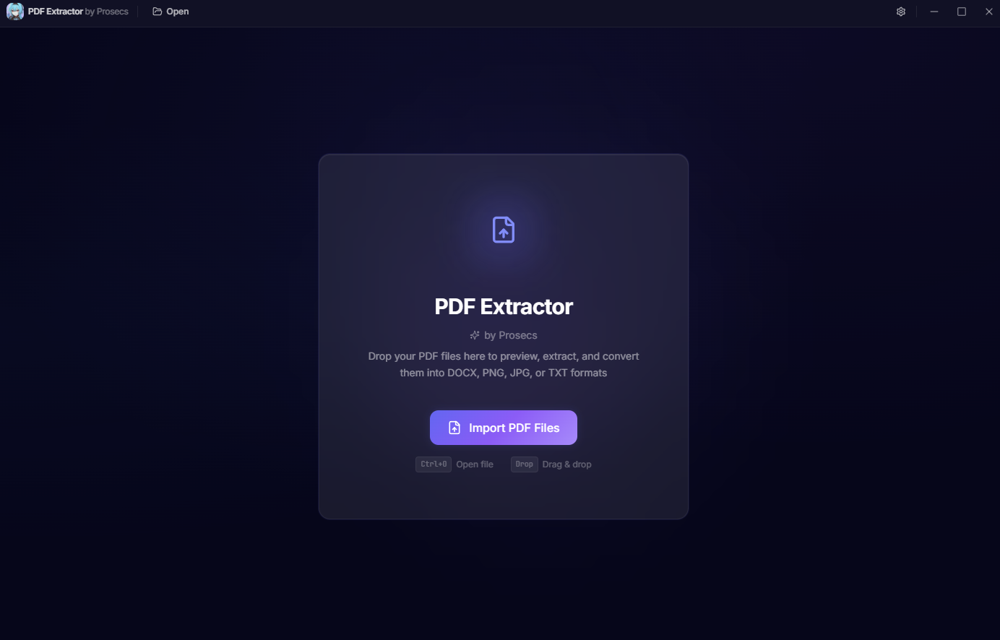
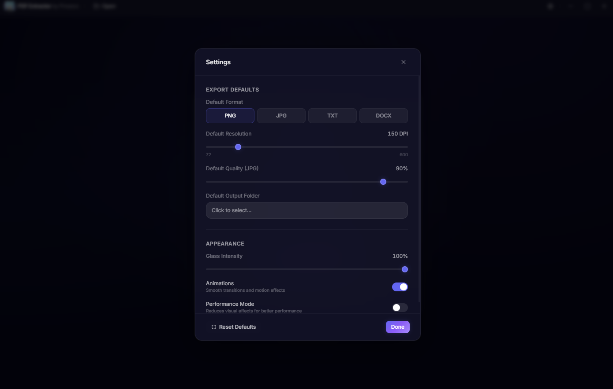
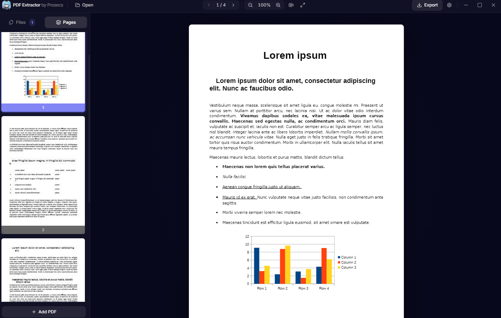
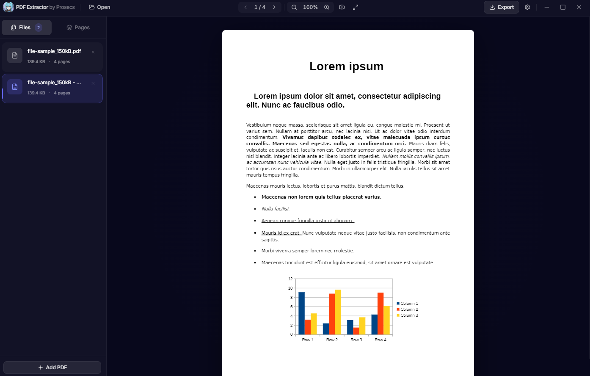
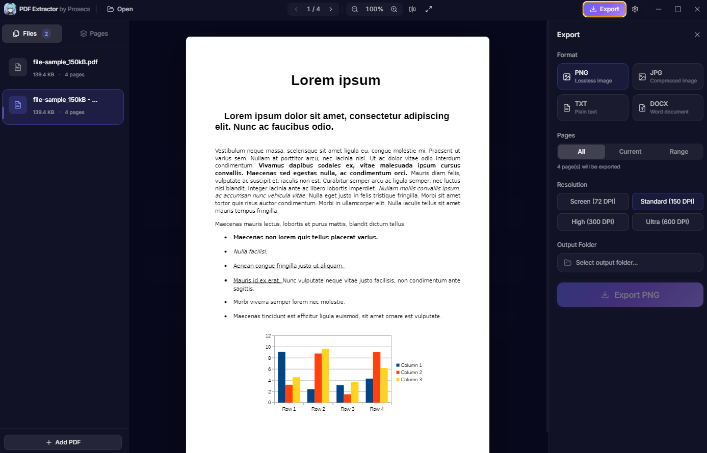

<p align="center">
  
</p>

<h1 align="center">PDF Extractor by Prosecs</h1>

<p align="center">
  <strong>A premium Windows desktop application for extracting, previewing, and converting PDF files.</strong>
</p>

<p align="center">
  
  
  
  
  
</p>

---

## Overview

**PDF Extractor by Prosecs** is a sleek, feature-rich desktop application built for Windows that lets you import PDF documents, preview them page-by-page, and export/convert them into multiple formats — all wrapped in a stunning dark "liquid glass" UI.

No cloud uploads. No subscriptions. Everything runs locally on your machine.

---

## Features

- **PDF Import & Preview** — Open single or multiple PDF files with a full in-app page-by-page preview, zoom controls, and fit-to-width/fit-to-page options.
- **Multi-Format Export** — Convert PDF pages to:
  - **PNG** — Lossless high-quality images
  - **JPG** — Compressed images with adjustable quality (10–100%)
  - **TXT** — Extracted plain text content
  - **DOCX** — Formatted Microsoft Word documents
- **Flexible Page Selection** — Export all pages, just the current page, or a custom range (e.g. `1-3, 5, 8-10`).
- **Resolution Control** — Choose from Screen (72 DPI), Standard (150 DPI), High (300 DPI), or Ultra (600 DPI) for image exports.
- **Drag & Drop** — Drop PDF files directly into the app to import them instantly.
- **Multi-File Management** — Import and switch between multiple PDFs via the sidebar file list.
- **Page Thumbnails** — Visual thumbnail grid of all pages for quick navigation.
- **Batch Export Queue** — Track export progress with a real-time batch queue.
- **Keyboard Shortcuts** — Navigate pages, zoom, and trigger exports without touching the mouse.
- **Persistent Settings** — Your preferences (default format, resolution, quality, output folder) are saved between sessions.
- **Custom Frameless Window** — A fully custom title bar with minimize, maximize, and close controls — no default Windows chrome.
- **Liquid Glass Dark Theme** — A premium dark UI with glass morphism effects, gradient accents, and smooth Framer Motion animations throughout.

---

<p align="center">
  
  
  
  
  
</p>

---

## Tech Stack

| Layer | Technology |
|-------|-----------|
| **Framework** | [Electron 33](https://www.electronjs.org/) |
| **Frontend** | [React 18](https://react.dev/) + [TypeScript](https://www.typescriptlang.org/) |
| **Build Tool** | [Vite 6](https://vitejs.dev/) + [vite-plugin-electron](https://github.com/electron-vite/vite-plugin-electron) |
| **Styling** | [Tailwind CSS 3](https://tailwindcss.com/) |
| **Animations** | [Framer Motion 11](https://www.framer.com/motion/) |
| **State Management** | [Zustand 5](https://zustand-demo.pmnd.rs/) (with persist middleware) |
| **PDF Rendering** | [pdf.js (pdfjs-dist)](https://mozilla.github.io/pdf.js/) |
| **DOCX Generation** | [docx](https://docx.js.org/) |
| **Icons** | [Lucide React](https://lucide.dev/) |
| **Notifications** | [Sonner](https://sonner.emilkowal.dev/) |
| **Packaging** | [electron-builder](https://www.electron.build/) (NSIS installer) |

---

## Project Structure

```
PDF Extactor/
├── electron/
│   ├── main.ts              # Electron main process (IPC handlers, file I/O, DOCX export)
│   └── preload.ts           # Secure contextBridge API (IPC bridge)
├── src/
│   ├── App.tsx               # Root app component
│   ├── main.tsx              # React entry point
│   ├── components/
│   │   ├── Toolbar/          # Custom title bar with navigation, zoom, and window controls
│   │   ├── Sidebar/          # File list + page thumbnails sidebar
│   │   ├── Preview/          # PDF canvas renderer
│   │   ├── ExportPanel/      # Export format, pages, resolution, output config
│   │   ├── BatchQueue/       # Real-time export progress queue
│   │   ├── DragDrop/         # Drag-and-drop overlay zone
│   │   ├── EmptyState/       # Welcome screen when no files loaded
│   │   ├── Settings/         # Settings modal
│   │   ├── Layout/           # App layout shell + loading overlay
│   │   └── common/           # Reusable UI (Button, GlassCard, ProgressBar, Skeleton)
│   ├── hooks/
│   │   ├── usePdf.ts         # PDF loading, rendering, and text extraction
│   │   ├── useExport.ts      # Export pipeline (PNG, JPG, TXT, DOCX)
│   │   └── useKeyboardShortcuts.ts
│   ├── store/
│   │   ├── useAppStore.ts    # Global app state (files, pages, zoom, UI toggles)
│   │   └── useSettingsStore.ts # Persisted user preferences
│   └── types/
│       └── index.ts          # TypeScript type definitions
├── build/
│   ├── icon.ico              # Windows app icon
│   └── icon.png              # PNG app icon
├── public/
│   └── logo.jpg              # In-app toolbar logo
├── package.json
├── vite.config.ts
├── tailwind.config.js
├── tsconfig.json
└── tsconfig.node.json
```

---

## Usage

1. **Open the app** — Double-click the installed application or run `npm run dev` for development.
2. **Import PDFs** — Click the **Open** button in the toolbar, or drag-and-drop PDF files into the window.
3. **Preview** — Use the center canvas to view pages. Navigate with the toolbar arrows or keyboard shortcuts.
4. **Zoom** — Use `Ctrl +` / `Ctrl -` or the toolbar zoom controls. Fit-to-width and fit-to-page buttons are also available.
5. **Switch Files** — Use the **Files** tab in the left sidebar to switch between imported PDFs.
6. **Browse Pages** — Use the **Pages** tab in the left sidebar to see thumbnail previews of all pages.
7. **Export** — Click the **Export** button to open the export panel. Choose your format, page selection, resolution, and output folder, then hit export.

---

## Keyboard Shortcuts

| Shortcut | Action |
|----------|--------|
| `Ctrl + O` | Open / Import PDF files |
| `Ctrl + E` | Toggle export panel |
| `Ctrl + ,` | Open settings |
| `Ctrl + =` | Zoom in |
| `Ctrl + -` | Zoom out |
| `Ctrl + 0` | Fit width |
| `Ctrl + 9` | Fit page |
| `←` / `→` | Previous / Next page |
| `Home` / `End` | First / Last page |
| `Escape` | Close panels |

---

## Security

- **Context Isolation** enabled — the renderer process has no direct access to Node.js APIs.
- **Node Integration** disabled — all system operations go through a secure `contextBridge` preload script.
- **No remote content** — the app runs entirely offline with local files only.

---

## License

This project is licensed under the [MIT License](LICENSE).

---

<p align="center">
  Built with care by <strong>Prosecs</strong>
</p>
